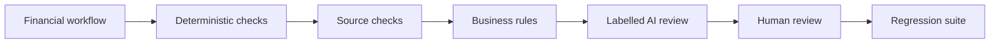

# HOLCO

HOLCO construit une couche d'intelligence et de contrôle pour les opérations
financières : accès gouverné aux données, contrôles reproductibles, agents IA
et validation humaine lorsque la décision engage l'entreprise.

> Deterministic when possible. AI when necessary. Human when accountable.

- [Site](https://holco.co)
- [Lab technique](https://apps.holco.co)
- [État des services](https://holco.co/status/)
- [Documentation sécurité](https://holco.co/securite/)
- [Signalement de sécurité](https://holco.co/.well-known/security.txt)

## Open engineering

### [HOLCO Finance Controls](https://github.com/holco-apps/holco-finance-controls)

Un cadre public, petit et reproductible, pour contrôler qu'un agent financier
respecte les chiffres, les sources et les règles métier, et pas seulement qu'il
formule une réponse crédible.

Le dépôt fournit un Golden Set synthétique, des contrôles déterministes, des
résultats `PASS` / `REVIEW` / `FAIL` / `INCONCLUSIVE` / `NOT_RUN`, un protocole
de preuve, une suite de tests Python et une politique explicite d'escalade
humaine. Aucun code de production ni donnée client n'y est publié.

### [HOLCO FEC Controls](https://github.com/holco-apps/holco-fec-controls)

Des contrôles déterministes et explicables de données FEC synthétiques,
exposés par un serveur MCP local compatible avec Claude. Le serveur ne lit
aucun chemin arbitraire et ne prétend pas certifier la conformité fiscale.

## Ce que nous construisons

- des connecteurs MCP et API avec permissions et périmètres explicites ;
- des contrôles déterministes séparés de la génération probabiliste ;
- des contrôles fondés sur les sources, les nombres et les règles métier ;
- du context engineering, de la mémoire gouvernée et des traces auditables ;
- des parcours human-in-the-loop pour les décisions engageantes.

Notre socle associe TypeScript, Node.js et Python/FastAPI selon les produits,
avec des services isolés derrière TLS. Les capacités réellement opérées, leurs
limites et l'état des services sont documentés dans le Lab et sur la page de
statut ; une feuille de route n'est pas présentée comme une capacité acquise.

## Publication responsable

Nous publions des jeux de contrôle synthétiques, contrats, exemples et composants
isolés qui peuvent être audités sans exposer un client ni son processus métier.
Les données clients, secrets, configurations de production, historiques
internes et règles propriétaires restent privés.

HOLCO INVEST · Paris · [alan@holco.co](mailto:alan@holco.co)

DPO : Pierre Coquard · [privacy@holco.co](mailto:privacy@holco.co)
